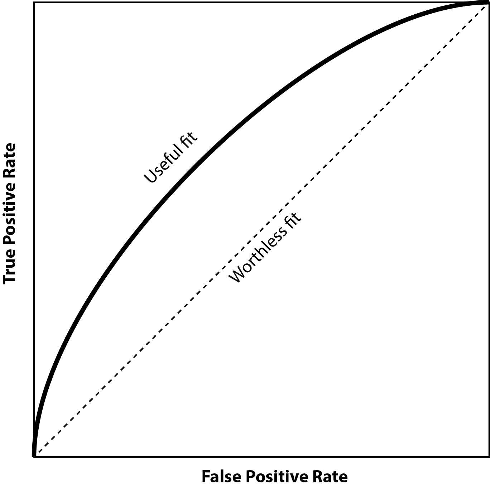

<link rel="stylesheet" href="css/styles.css">

```{r setup, include=FALSE}
knitr::opts_chunk$set(echo=TRUE, cache=FALSE, results="hide", message=FALSE, warning=FALSE)
```

```{r set-up}

# Several libraries and util functions from my GitHub
source("https://raw.githubusercontent.com/Leejere/r-setup/main/r_setup.r")
```

# Introduction

-   State the problem, the importance of the problem, and the setting of the analysis (Philadelphia).
-   Speculate as to **why** the predictors we are using might be associated with the dependent variable.
-   Indicate the tool (R).

# Methods

## Construting and interpreting the model

In an OLS regression, we dealt with dependent variables whose values were continuous with a reasonably large range, so that the model could be explained as one unit's change of a predictor correlating with how many units' change of the dependent variable (holding other variables constant). However, this explanation no longer applies when the dependent variable is binary, as it only takes values of either 0 or 1.

The logistic regression method works around this problem by turning the $y$ in the equation from *binary* to continuous *probability*. In this way, we may say that one unit's change of a predictor is correlated with certain increase or decrease in the probability of the dependent variable being "True". However, this brings another problem, as probability only ranges from 0 to 1, whereas the OLS regression is a linear model in which the $y$ should have no lower and upper bounds. To solve this problem, we can construct a new variable, $ln\frac{p}{1-p}$, in which $p$ is the probability of the dependent variable being "True" ($p=P(drink=1)$). The ratio of "True" probability against "False" probability is called the *odds*. By wrapping the *odds* inside of a log-transform, we have successfully turned the scope of $y$ to from $-\infty$ to $\infty$.

The translator function of $ln(\frac{p}{1-p})$ is called the the *logit function*. As the input probability approaches zero, the output logit odds approaches $-\infty$; conversely, if the input probability is close to 1, the output logit odds reaches $\infty$. In this way, the binary variable is successfully transformed into a continuous one with an infinite scope, so that we can use it as the new $y$ and fit a model.

The final equation for the logistic model is written as follows:

$$
ln(\frac{p}{1-p})=\beta_0 + \beta_1\cdot fatal\_injury + \beta_2\cdot overturned + \beta_3\cdot phone + \beta_4\cdot speeding + \beta_5\cdot aggressive + \beta_6\cdot teen\_driver + \beta_7\cdot senior\_driver + \epsilon
$$

where $ln(\frac{p}{1-p})$ is the "log odds" where $p$ is the probability of the crash being caused by alcohol, $\beta_0$ is the intercept coefficient, $\beta_1$ to $\beta_n$ are the coefficients of the 7 predictors, and $\epsilon$ is the residual. The model is estimated through the Maximum Likelihood Method.

We determine whether each coefficient is significant through hypothesis testing. For each coefficient $\beta_i$, the *null hypothesis* ($H_0$) is that $\beta_i=0$. As $\beta_i$ has a normal distribution with a standard deviation of $\sigma_{\beta_i}$, we may calculate a Z-score through $\frac{\hat\beta_i - 0}{\sigma_{\beta_i}}$ where $\hat\beta_i$ is the coefficient estimated from the model. If the p-value associated with the Z-score goes under 0.05, we reject the null hypothesis for the *alternative hypothesis* that $\beta_i\neq0$.

To interpret the coefficients, most statisticians use a concept of *odds ratio*, which is calculated by exponentiating the $\beta$ coefficients ($e^{\beta_i}$). For every unit of change in the predictor $\x_i$, the odds ratio increases by a factor of $e^{\beta_i}$.

It should be noted that the logistic model only outputs the estimated *probabilities*; and to obtain the predictions for the dependent variable, we need to determine a "cutoff probability", above which the dependent variable is predicted to be true and below which false.

## Model goodness of fit

How do we determine the goodness of fit of a logistic regression model? As in the OLS model, $R^2$ can be estimated, but it no longer bears the interpretation as the ratio of variance explained by the model. To compare the goodness of fit of multiple nested models, we may use the Akaike Information Criterion, a smaller value of which indicates a better fit compared to the baseline model.

As mentioned in the previous section, the predictions for the dependent variable depend on the "cutoff probability" that we set. An observation is predicted to be true ($\hat y=1$), if the estimated probability $p$ is higher than the threshold, and vice versa. Then, each observation is categorized into one of the four following categories:

|                    | Observed True      | Observed False     |
|--------------------|--------------------|--------------------|
| Predicted Positive | TP: True Positive  | FP: False Positive |
| Predicted Negative | FN: False Negative | TN: True Negative  |

The goal is to find the best cutoff value that maximizes TP and TN, while minimizing FP and FN. Specifically,
-   *Sensitivity*, or *True Positive Rate*, stands for how well the model is able to pick out the True observations, and is calculated as $\frac{TP}{TP+FN}$.
-   *Specificity*, or *True Negative Rate* stands for how well the model accurately predicts false values, and is calculated as $\frac{TN}{TN+FP}$.

Deciding on the right cutoff value is often a trade-off process. If the cutoff value is set to be relatively high, then fewer observations will be predicted as true. The sensitivity may lower, but the specificity increases. On the other hand, a lower cutoff value categorizes more observations to be true, often increasing sensitivity but lowering specificity. This trade-off process can be visualized using the *ROC curve*, in which the x-axis stands for false positive rate, or one minus specificity, and the y-axis stands for true positive rate or sensitivity. As you lower the cutoff value, the false positive rate goes up, whereas the true positive rate also goes up, forming a curve depicted as follows:



This diagram can help us find a combination of reasonably high sensitivity and specificity, i.e., a point as close to the upper-left corner as possible. A few methods exist the determine this point:
-   By maximizing the sum of sensitivity and specificity, or the *Youden Index*.
-   By minimizing the distance on the ROC plot from the curve to the upper left corner.

If we have a good model, all the points on the ROC curve (no matter the cutoff value) will be generally closer to the upper-left corner, and the area under the curve will be greater. Therefore, the Area Under the Curve, or AUC, is another criterion of the goodness of fit of the logistic model.

## Model Assumptions

Like the OLS model, the logistic model also has a number of assumptions required of the data. These assumptions are:
-   The dependent variable is binary.
-   The observations are independent from each other.
-   There is no severe multi-collinearity among the predictors.
-   Large sample size is required, as the model is estimated through the Maximum Likelihood Estimation method.

Unlike the OLS, however, the logistic regression model makes no assumption that the relationship between the dependent variable and each predictor is normal. It does not require homoscedasticity, nor the normality of the distribution of residuals.


## Exploratory analysis before a logistic regression

Before running a logistic regression, statisticians often carry out a series of exploratory analysis.

**Cross-tabulation between the dependent variable and categorical predictors**. We can cross-tabulate all the observations into groups, each group being a combination of the true/false value of the dependent and a class of the predictor. A *chi-square test* is performed. Its null hypothesis is that there is no significant difference in terms of outcome (dependent variable) between the classes, as opposed to the alternative hypothesis of there being a significant difference. If the null hypothesis stands, then the chi-square value should be of chi-square distribution. If the p-value of the observed chi-square is reasonably small (i.e., smaller than 0.05), then we may reject the null hypothesis for the alternative hypothesis and state that the predictor is indeed correlated with the dependent variable.

**Independent-sample T-tests**. To examine the correlation between dependent variable and a continuous predictor, we may calculate the mean value of the predictor by the binary outcome. The true or false of the binary outcome essentially divides all the observations into two samples, and then we can test whether there is a significant difference between the two samples through an independent-sample T-test. The null hypothesis for this test is that there is no significant difference between the two samples. If such hypothesis stands, then the difference of the two sample means will be of T-distribution. If the observed T-score is associated with a p-value lower than 0.05, then we reject the null hypothesis for the alternative hypothesis that there is significant difference between the two samples, and therefore the predictor is correlated with the dependent variable.